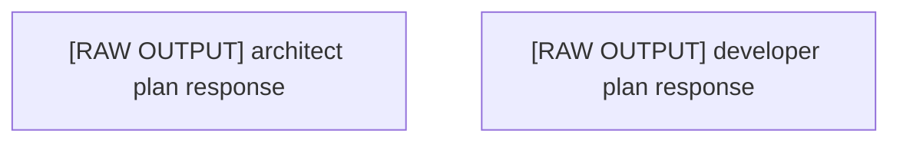

# Execution Plan: Plan Metadata

## 🎯 Project Vision
## 📋 Plan Overview

plan ultrathink

### 📊 Plan Metadata
- **Plan ID**: plan_1757341400745_ba1873cf
- **Created**: 9/8/2025, 10:23:20 AM
- **Complexity**: 1/10
- **Estimated Time**: 4 hours
- **Risk Level**: low
- **Total Tasks**: 1

### 🔧 Repository Profile
- **Languages**: Swift
- **Frameworks**: 
- **Test Framework**: None

### 📅 Execution Phases
1. **architect Phase**: Tasks from architect perspective (raw output - needs manual parsing)

### 🎯 Critical Path
The following tasks are on the critical path and will determine overall completion time:
- [RAW OUTPUT] architect plan response

### ⚡ Parallel Execution Groups
Tasks that can be executed simultaneously:
**Group 1**: [RAW OUTPUT] architect plan response, Task 2

### 🚀 Execution
This epic tracks the automated execution of all subtasks.
- Subtasks will be created and linked below
- Dependencies are managed via labels
- Progress will be updated automatically

---
*Generated by Claude Go-Go v4.0 using Opus 4.1*
*Plan ID: plan_1757341400745_ba1873cf*

### Original Requirements
## 📋 Plan Overview

plan ultrathink

### 📊 Plan Metadata
- **Plan ID**: plan_1757341400745_ba1873cf
- **Created**: 9/8/2025, 10:23:20 AM
- **Complexity**: 1/10
- **Estimated Time**: 4 hours
- **Risk Level**: low
- **Total Tasks**: 1

### 🔧 Repository Profile
- **Languages**: Swift
- **Frameworks**: 
- **Test Framework**: None

### 📅 Execution Phases
1. **architect Phase**: Tasks from architect perspective (raw output - needs manual parsing)

### 🎯 Critical Path
The following tasks are on the critical path and will determine overall completion time:
- [RAW OUTPUT] architect plan response

### ⚡ Parallel Execution Groups
Tasks that can be executed simultaneously:
**Group 1**: [RAW OUTPUT] architect plan response, Task 2

### 🚀 Execution
This epic tracks the automated execution of all subtasks.
- Subtasks will be created and linked below
- Dependencies are managed via labels
- Progress will be updated automatically

---
*Generated by Claude Go-Go v4.0 using Opus 4.1*
*Plan ID: plan_1757341400745_ba1873cf*

## 🏗 Architecture Overview

### Technology Stack
- **Languages**: Swift
- **Frameworks**: Not specified
- **Test Framework**: 

### Key Architectural Decisions
- Component-based architecture with clear separation of concerns
- Modular design for maintainability and scalability
- Progressive enhancement approach

## 📊 Plan Metadata
- **Plan ID**: plan_1757341679321_32820028
- **Created**: 2025-09-08T14:27:59.321Z
- **Complexity**: 1/10
- **Estimated Time**: 4
- **Risk Level**: low
- **Total Tasks**: 2
- **Phases**: 1

## Phases

### Phase 1: architect Phase
Tasks from architect perspective (raw output - needs manual parsing)

**Tasks in this phase:**
- [ ] [RAW OUTPUT] architect plan response
  - The architect agent provided the following response:

I've created a comprehensive UI & Design epic plan for the AI Tamagotchi project with **8 parallel epics** and **56 specific tasks**. The plan is saved as `tamagotchi-ui-design-epic-plan.json`.

### The 8 UI/Design Epics:

1. **Design System & Component Library** (6 tasks) - Foundation for all UI work
2. **Pet Visualization & Animation** (7 tasks) - Core pet visual experience
3. **Main App Interface** (7 tasks) - Primary app screens and navigation
4. **Interaction Interfaces** (7 tasks) - User-pet interaction mechanics
5. **Apple Watch Interface** (6 tasks) - Watch-specific UI components
6. **Data Visualization & Analytics** (6 tasks) - Metrics and progress displays
7. **Feedback & Status Systems** (6 tasks) - User feedback mechanisms
8. **Visual Polish & Branding** (6 tasks) - Final polish and brand identity

All epics can be developed in parallel by different teams, focusing on SwiftUI implementation for iOS 17+ and watchOS 10+. Each epic represents a complete UI subsystem that can be independently developed and tested.
- [ ] [RAW OUTPUT] developer plan response
  - The developer agent provided the following response:

I've created a comprehensive UI & Design implementation plan for the AI Tamagotchi iOS/watchOS app with 6 parallelizable epics and 46 specific tasks:

### Epic Structure:
1. **Core UI Components Library** - 8 reusable SwiftUI components
2. **Pet Visualization System** - 7 animation and rendering tasks  
3. **Main App Screens** - 8 primary iPhone interface screens
4. **Apple Watch Interface** - 7 watchOS-specific components
5. **Theme & Design System** - 8 design system tasks
6. **Animations & Interactions** - 8 motion design tasks

### Key Features:
- Native iOS/watchOS using SwiftUI
- Focus on pet interactions and animations
- Separate iPhone and Apple Watch interfaces
- Comprehensive theming and accessibility support
- Gesture-based interactions with haptic feedback
- SF Symbols integration for consistent iconography

The epics are designed to be developed in parallel by different team members, with clear dependencies noted (e.g., Theme & Design System should be completed first as other epics depend on it).

## Detailed Task Breakdown

Total Tasks: 2

### Task 1: [RAW OUTPUT] architect plan response
- **ID**: e1-t1
- **Source**: architect
- **Priority**: high
- **Phase**: 1
- **Description**: The architect agent provided the following response:

I've created a comprehensive UI & Design epic plan for the AI Tamagotchi project with **8 parallel epics** and **56 specific tasks**. The plan is saved as `tamagotchi-ui-design-epic-plan.json`.

### The 8 UI/Design Epics:

1. **Design System & Component Library** (6 tasks) - Foundation for all UI work
2. **Pet Visualization & Animation** (7 tasks) - Core pet visual experience
3. **Main App Interface** (7 tasks) - Primary app screens and navigation
4. **Interaction Interfaces** (7 tasks) - User-pet interaction mechanics
5. **Apple Watch Interface** (6 tasks) - Watch-specific UI components
6. **Data Visualization & Analytics** (6 tasks) - Metrics and progress displays
7. **Feedback & Status Systems** (6 tasks) - User feedback mechanisms
8. **Visual Polish & Branding** (6 tasks) - Final polish and brand identity

All epics can be developed in parallel by different teams, focusing on SwiftUI implementation for iOS 17+ and watchOS 10+. Each epic represents a complete UI subsystem that can be independently developed and tested.
- **Implementation Approach**:
  - Follow existing patterns in the codebase
  - Ensure compatibility with other components
  - Add appropriate tests and documentation
- **Acceptance Criteria**:
  - ☑ Implementation follows plan specifications
  - ☑ Code is properly tested
  - ☑ Documentation is updated
  - ☑ Integration with other components verified

### Task 2: [RAW OUTPUT] developer plan response
- **ID**: e1-t2
- **Source**: developer
- **Priority**: medium
- **Phase**: 1
- **Description**: The developer agent provided the following response:

I've created a comprehensive UI & Design implementation plan for the AI Tamagotchi iOS/watchOS app with 6 parallelizable epics and 46 specific tasks:

### Epic Structure:
1. **Core UI Components Library** - 8 reusable SwiftUI components
2. **Pet Visualization System** - 7 animation and rendering tasks  
3. **Main App Screens** - 8 primary iPhone interface screens
4. **Apple Watch Interface** - 7 watchOS-specific components
5. **Theme & Design System** - 8 design system tasks
6. **Animations & Interactions** - 8 motion design tasks

### Key Features:
- Native iOS/watchOS using SwiftUI
- Focus on pet interactions and animations
- Separate iPhone and Apple Watch interfaces
- Comprehensive theming and accessibility support
- Gesture-based interactions with haptic feedback
- SF Symbols integration for consistent iconography

The epics are designed to be developed in parallel by different team members, with clear dependencies noted (e.g., Theme & Design System should be completed first as other epics depend on it).
- **Implementation Approach**:
  - Follow existing patterns in the codebase
  - Ensure compatibility with other components
  - Add appropriate tests and documentation
- **Acceptance Criteria**:
  - ☑ Implementation follows plan specifications
  - ☑ Code is properly tested
  - ☑ Documentation is updated
  - ☑ Integration with other components verified

## Dependency Graph

## Execution Order

1. [RAW OUTPUT] architect plan response
2. [RAW OUTPUT] developer plan response

## Parallel Execution Groups

Tasks that can be executed in parallel:

**Group 1:**
- [RAW OUTPUT] architect plan response
- [RAW OUTPUT] developer plan response

## 🔄 Subtask Coordination

### How to Use This Plan
When working on a subtask:
1. **Read the entire plan** to understand the project vision
2. **Review your task's dependencies** to understand prerequisites
3. **Check related tasks** to ensure consistency
4. **Follow the architectural decisions** outlined above
5. **Update this document** if you make significant architectural changes

### Integration Points
Each task should:
- Expose clear interfaces for other components
- Follow established naming conventions
- Use consistent data structures
- Provide proper TypeScript types/interfaces

