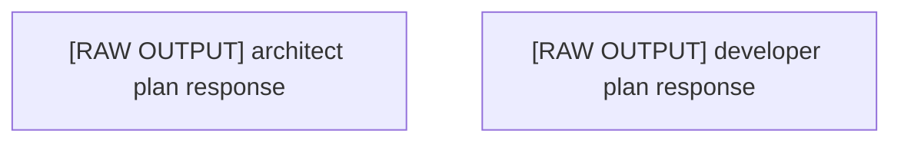

# Execution Plan: Plan Redo Ultrathink

## 🎯 Project Vision
plan redo and ultrathink

### Original Requirements
plan redo and ultrathink

## 🏗 Architecture Overview

### Technology Stack
- **Languages**: Swift
- **Frameworks**: Not specified
- **Test Framework**: 

### Key Architectural Decisions
- Component-based architecture with clear separation of concerns
- Modular design for maintainability and scalability
- Progressive enhancement approach

## 📊 Plan Metadata
- **Plan ID**: plan_1757476519420_a686f461
- **Created**: 2025-09-10T03:55:19.420Z
- **Complexity**: 1/10
- **Estimated Time**: 4
- **Risk Level**: low
- **Total Tasks**: 2
- **Phases**: 1

## Phases

### Phase 1: architect Phase
Tasks from architect perspective (raw output - needs manual parsing)

**Tasks in this phase:**
- [ ] [RAW OUTPUT] architect plan response
  - The architect agent provided the following response:

<ultrathink> The user is asking me to create a hierarchical plan for an AI Tamagotchi app. This is a planning task, not a coding task. I need to analyze the repository structure and create a strategic breakdown into major work streams.
- [ ] [RAW OUTPUT] developer plan response
  - The developer agent provided the following response:

of Implementation Plan:

### 7 Technical Epics:
1. **Core Data & Models** - Foundation layer with SwiftData persistence
2. **AI & Machine Learning** - Phi-3 Mini integration and personality system  
3. **iOS UI & Experience** - iPhone app interface with SwiftUI
4. **watchOS Companion** - Apple Watch app with complications
5. **Game Mechanics** - Pet behavior and gameplay using GameplayKit
6. **Health & Activity Integration** - HealthKit features for wellness
7. **Sync & Cloud Services** - CloudKit for cross-device sync

### 4 Implementation Phases:
1. **Foundation Phase** - Core models and game mechanics
2. **Intelligence Phase** - AI integration
3. **Interface Phase** - iOS and watchOS UIs
4. **Enhancement Phase** - Health integration and cloud sync

The plan includes proper dependencies between tasks and can be executed by parallel teams, with each epic being largely independent while integrating at defined interface points.

## Detailed Task Breakdown

Total Tasks: 2

### Task 1: [RAW OUTPUT] architect plan response
- **ID**: e1-t1
- **Source**: architect
- **Priority**: high
- **Phase**: 1
- **Description**: The architect agent provided the following response:

<ultrathink> The user is asking me to create a hierarchical plan for an AI Tamagotchi app. This is a planning task, not a coding task. I need to analyze the repository structure and create a strategic breakdown into major work streams.
- **Implementation Approach**:
  - Follow existing patterns in the codebase
  - Ensure compatibility with other components
  - Add appropriate tests and documentation
- **Acceptance Criteria**:
  - ☑ Implementation follows plan specifications
  - ☑ Code is properly tested
  - ☑ Documentation is updated
  - ☑ Integration with other components verified

### Task 2: [RAW OUTPUT] developer plan response
- **ID**: e2-t1
- **Source**: developer
- **Priority**: medium
- **Phase**: 1
- **Description**: The developer agent provided the following response:

of Implementation Plan:

### 7 Technical Epics:
1. **Core Data & Models** - Foundation layer with SwiftData persistence
2. **AI & Machine Learning** - Phi-3 Mini integration and personality system  
3. **iOS UI & Experience** - iPhone app interface with SwiftUI
4. **watchOS Companion** - Apple Watch app with complications
5. **Game Mechanics** - Pet behavior and gameplay using GameplayKit
6. **Health & Activity Integration** - HealthKit features for wellness
7. **Sync & Cloud Services** - CloudKit for cross-device sync

### 4 Implementation Phases:
1. **Foundation Phase** - Core models and game mechanics
2. **Intelligence Phase** - AI integration
3. **Interface Phase** - iOS and watchOS UIs
4. **Enhancement Phase** - Health integration and cloud sync

The plan includes proper dependencies between tasks and can be executed by parallel teams, with each epic being largely independent while integrating at defined interface points.
- **Implementation Approach**:
  - Follow existing patterns in the codebase
  - Ensure compatibility with other components
  - Add appropriate tests and documentation
- **Acceptance Criteria**:
  - ☑ Implementation follows plan specifications
  - ☑ Code is properly tested
  - ☑ Documentation is updated
  - ☑ Integration with other components verified

## Dependency Graph

## Execution Order

1. [RAW OUTPUT] architect plan response
2. [RAW OUTPUT] developer plan response

## Parallel Execution Groups

Tasks that can be executed in parallel:

**Group 1:**
- [RAW OUTPUT] architect plan response
- [RAW OUTPUT] developer plan response

## 🔄 Subtask Coordination

### How to Use This Plan
When working on a subtask:
1. **Read the entire plan** to understand the project vision
2. **Review your task's dependencies** to understand prerequisites
3. **Check related tasks** to ensure consistency
4. **Follow the architectural decisions** outlined above
5. **Update this document** if you make significant architectural changes

### Integration Points
Each task should:
- Expose clear interfaces for other components
- Follow established naming conventions
- Use consistent data structures
- Provide proper TypeScript types/interfaces

