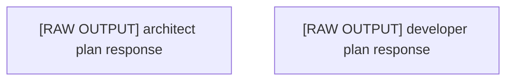

# Execution Plan: Plan Ultrathink

## 🎯 Project Vision
plan ultrathink

### Original Requirements
plan ultrathink

## 🏗 Architecture Overview

### Technology Stack
- **Languages**: Swift
- **Frameworks**: Not specified
- **Test Framework**: 

### Key Architectural Decisions
- Component-based architecture with clear separation of concerns
- Modular design for maintainability and scalability
- Progressive enhancement approach

## 📊 Plan Metadata
- **Plan ID**: plan_1757361821457_4e14b442
- **Created**: 2025-09-08T20:03:41.457Z
- **Complexity**: 1/10
- **Estimated Time**: 4
- **Risk Level**: low
- **Total Tasks**: 2
- **Phases**: 1

## Phases

### Phase 1: architect Phase
Tasks from architect perspective (raw output - needs manual parsing)

**Tasks in this phase:**
- [ ] [RAW OUTPUT] architect plan response
  - The architect agent provided the following response:

Error: Task plan-architect-comment-3267745824-1757361510857 timed out after 300000ms
- [ ] [RAW OUTPUT] developer plan response
  - The developer agent provided the following response:

Created comprehensive implementation plan for AI Tamagotchi with 7 epics containing 59 tasks organized into parallelizable work streams. The plan includes Core Data Models, AI/ML Services, Game Mechanics, iOS UI, WatchOS App, Integration Services, and Testing Infrastructure.

## Detailed Task Breakdown

Total Tasks: 2

### Task 1: [RAW OUTPUT] architect plan response
- **ID**: e1-t1
- **Source**: architect
- **Priority**: high
- **Phase**: 1
- **Description**: The architect agent provided the following response:

Error: Task plan-architect-comment-3267745824-1757361510857 timed out after 300000ms
- **Implementation Approach**:
  - Follow existing patterns in the codebase
  - Ensure compatibility with other components
  - Add appropriate tests and documentation
- **Acceptance Criteria**:
  - ☑ Implementation follows plan specifications
  - ☑ Code is properly tested
  - ☑ Documentation is updated
  - ☑ Integration with other components verified

### Task 2: [RAW OUTPUT] developer plan response
- **ID**: e2-t1
- **Source**: developer
- **Priority**: medium
- **Phase**: 1
- **Description**: The developer agent provided the following response:

Created comprehensive implementation plan for AI Tamagotchi with 7 epics containing 59 tasks organized into parallelizable work streams. The plan includes Core Data Models, AI/ML Services, Game Mechanics, iOS UI, WatchOS App, Integration Services, and Testing Infrastructure.
- **Implementation Approach**:
  - Follow existing patterns in the codebase
  - Ensure compatibility with other components
  - Add appropriate tests and documentation
- **Acceptance Criteria**:
  - ☑ Implementation follows plan specifications
  - ☑ Code is properly tested
  - ☑ Documentation is updated
  - ☑ Integration with other components verified

## Dependency Graph

## Execution Order

1. [RAW OUTPUT] architect plan response
2. [RAW OUTPUT] developer plan response

## Parallel Execution Groups

Tasks that can be executed in parallel:

**Group 1:**
- [RAW OUTPUT] architect plan response
- [RAW OUTPUT] developer plan response

## 🔄 Subtask Coordination

### How to Use This Plan
When working on a subtask:
1. **Read the entire plan** to understand the project vision
2. **Review your task's dependencies** to understand prerequisites
3. **Check related tasks** to ensure consistency
4. **Follow the architectural decisions** outlined above
5. **Update this document** if you make significant architectural changes

### Integration Points
Each task should:
- Expose clear interfaces for other components
- Follow established naming conventions
- Use consistent data structures
- Provide proper TypeScript types/interfaces

