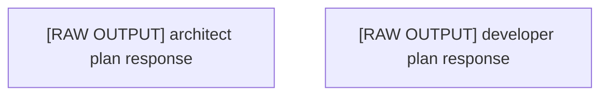

# Execution Plan: Plan Ultrathink

## 🎯 Project Vision
plan ultrathink

### Original Requirements
plan ultrathink

## 🏗 Architecture Overview

### Technology Stack
- **Languages**: Swift
- **Frameworks**: Not specified
- **Test Framework**: 

### Key Architectural Decisions
- Component-based architecture with clear separation of concerns
- Modular design for maintainability and scalability
- Progressive enhancement approach

## 📊 Plan Metadata
- **Plan ID**: plan_1757341400745_ba1873cf
- **Created**: 2025-09-08T14:23:20.746Z
- **Complexity**: 1/10
- **Estimated Time**: 4
- **Risk Level**: low
- **Total Tasks**: 2
- **Phases**: 1

## Phases

### Phase 1: architect Phase
Tasks from architect perspective (raw output - needs manual parsing)

**Tasks in this phase:**
- [ ] [RAW OUTPUT] architect plan response
  - The architect agent provided the following response:

I've created a hierarchical plan for the AI Tamagotchi app with 8 parallelizable epics representing major functional areas:

1. **Core AI Engine** (8 tasks) - On-device AI with Phi-3 Mini, personality system, conversation pipeline
2. **Data & Persistence Layer** (7 tasks) - SwiftData models, CloudKit sync, privacy controls
3. **Game Mechanics Engine** (8 tasks) - Pet lifecycle, stats, activities, evolution system
4. **iOS User Interface** (8 tasks) - Main pet view, chat interface, stats dashboard
5. **Apple Watch Companion** (7 tasks) - Watch app, complications, quick actions
6. **Health & Activity Integration** (7 tasks) - HealthKit integration, wellness features
7. **Notifications & Background Processing** (7 tasks) - Local notifications, Live Activities, widgets
8. **Visual & Animation System** (7 tasks) - Pet character design, animations, particle effects

Total: 59 tasks across 8 epics, all designed to be worked on independently and in parallel by different developers. Each epic represents a complete subsystem that can be developed without blocking others.
- [ ] [RAW OUTPUT] developer plan response
  - The developer agent provided the following response:

Error: Task plan-developer-comment-3266557950-1757341096413 timed out after 300000ms

## Detailed Task Breakdown

Total Tasks: 2

### Task 1: [RAW OUTPUT] architect plan response
- **ID**: e1-t1
- **Source**: architect
- **Priority**: high
- **Phase**: 1
- **Description**: The architect agent provided the following response:

I've created a hierarchical plan for the AI Tamagotchi app with 8 parallelizable epics representing major functional areas:

1. **Core AI Engine** (8 tasks) - On-device AI with Phi-3 Mini, personality system, conversation pipeline
2. **Data & Persistence Layer** (7 tasks) - SwiftData models, CloudKit sync, privacy controls
3. **Game Mechanics Engine** (8 tasks) - Pet lifecycle, stats, activities, evolution system
4. **iOS User Interface** (8 tasks) - Main pet view, chat interface, stats dashboard
5. **Apple Watch Companion** (7 tasks) - Watch app, complications, quick actions
6. **Health & Activity Integration** (7 tasks) - HealthKit integration, wellness features
7. **Notifications & Background Processing** (7 tasks) - Local notifications, Live Activities, widgets
8. **Visual & Animation System** (7 tasks) - Pet character design, animations, particle effects

Total: 59 tasks across 8 epics, all designed to be worked on independently and in parallel by different developers. Each epic represents a complete subsystem that can be developed without blocking others.
- **Implementation Approach**:
  - Follow existing patterns in the codebase
  - Ensure compatibility with other components
  - Add appropriate tests and documentation
- **Acceptance Criteria**:
  - ☑ Implementation follows plan specifications
  - ☑ Code is properly tested
  - ☑ Documentation is updated
  - ☑ Integration with other components verified

### Task 2: [RAW OUTPUT] developer plan response
- **ID**: e2-t1
- **Source**: developer
- **Priority**: medium
- **Phase**: 1
- **Description**: The developer agent provided the following response:

Error: Task plan-developer-comment-3266557950-1757341096413 timed out after 300000ms
- **Implementation Approach**:
  - Follow existing patterns in the codebase
  - Ensure compatibility with other components
  - Add appropriate tests and documentation
- **Acceptance Criteria**:
  - ☑ Implementation follows plan specifications
  - ☑ Code is properly tested
  - ☑ Documentation is updated
  - ☑ Integration with other components verified

## Dependency Graph

## Execution Order

1. [RAW OUTPUT] architect plan response
2. [RAW OUTPUT] developer plan response

## Parallel Execution Groups

Tasks that can be executed in parallel:

**Group 1:**
- [RAW OUTPUT] architect plan response
- [RAW OUTPUT] developer plan response

## 🔄 Subtask Coordination

### How to Use This Plan
When working on a subtask:
1. **Read the entire plan** to understand the project vision
2. **Review your task's dependencies** to understand prerequisites
3. **Check related tasks** to ensure consistency
4. **Follow the architectural decisions** outlined above
5. **Update this document** if you make significant architectural changes

### Integration Points
Each task should:
- Expose clear interfaces for other components
- Follow established naming conventions
- Use consistent data structures
- Provide proper TypeScript types/interfaces

